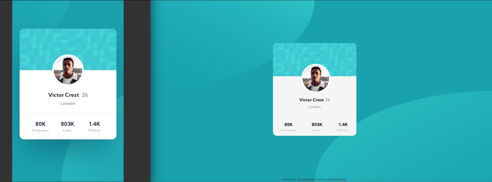

# profile-card-component
Frontend Masters Project #3

# Frontend Mentor - Profile card component solution

This is a solution to the [Profile card component challenge on Frontend Mentor](https://www.frontendmentor.io/challenges/profile-card-component-cfArpWshJ). Frontend Mentor challenges help you improve your coding skills by building realistic projects. 

## Table of contents

- [Overview](#overview)
  - [The challenge](#the-challenge)
  - [Screenshot](#screenshot)
  - [Links](#links)
- [My process](#my-process)
  - [Built with](#built-with)
- [Author](#author)

## Overview

### The challenge

Users should be able to:

- View the optimal layout depending on their device's screen size

### Screenshot

### Links

- Solution URL: [Add solution URL here](https://www.frontendmentor.io/solutions/stats-preview-card-mobilefirst-solution-using-css-flexbox-IQZU-Naop)
- Live Site URL: [Add live site URL here](https://mml-stats-preview-card-component.netlify.app/)

## My process

### Built with

- Semantic HTML5 markup
- CSS custom properties
- Flexbox
- Mobile-first workflow

## Author

- Website - (https://portfolio-mml.netlify.app/)
- Frontend Mentor - [@Michelle-Lefebvre](https://www.frontendmentor.io/profile/Michelle-Lefebvre)
- Twitter - [@MMLdesigns](https://twitter.com/MMLdesigns)